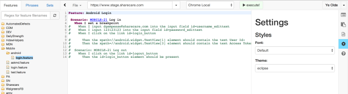

title: An Introduction to AngularJS
author:
  name: Daniel Gempesaw
  twitter: dgempesaw
  url: http://blog.danielgempesaw.com
output: index.html
controls: true

--

# An AngularJS Adventure
## what, why, and how: ng and you

<!-- hi, my name is Daniel Gempesaw! I'm going to be talking about -->
<!-- AngularJS - I've got a couple background slides about what Angular is, -->
<!-- why you might care, and then we're going to jump in and do some live -->
<!-- coding. -->

--

### who am I?

* our Software Testing Architect!
* live & work in New Haven, CT
* Started using Angular this year for Honeydew

<!-- in case you don't know me, I'm our Software Testing Architect! -->
<!-- You probably haven't seen me around the office because I've been -->
<!-- living and working in New Haven CT for the past year. My -->
<!-- "extensive" expertise comes from a few months this year using -->
<!-- Angular to rewrite the frontend Honeydew, our browser automation -->
<!-- framework -->

--

### what is angular

* frontend MV\* javascript framework: enhanced HTML

* create your own custom elements & attributes

* open source, via Google

<!-- so, angularJS is a front-end model-view-whatever javascript -->
<!-- framework. it's usually mentioned in the same sentence as backbone, -->
<!-- which we use here, or emberJS/knockoutJS/batmanJS. -->

<!-- Angular's goal is to make it easier to implement single page -->
<!-- applications - so, the user can load up the page and get dynamic -->
<!-- updates from the server without having to hit refresh, the way -->
<!-- all the fancy SPAs are doing it these days. -->

<!-- it's completely open source, and is strongly backed by -->
<!-- Google, which is very encouraging  -->

--

### why would I want to use angular?

* Testable from the ground up

* flexibility: provides a basic structure

* Plain HTML templates, plain bindings to javascript objects

* Make your own HTML elements!
